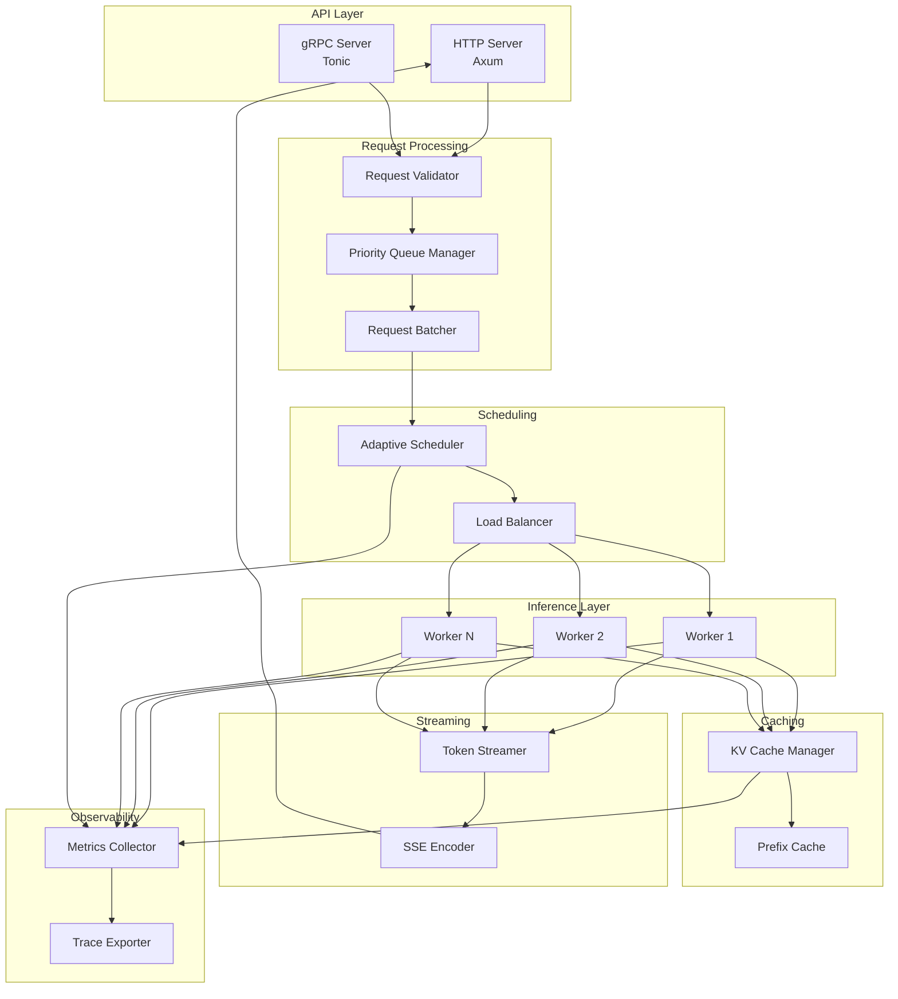
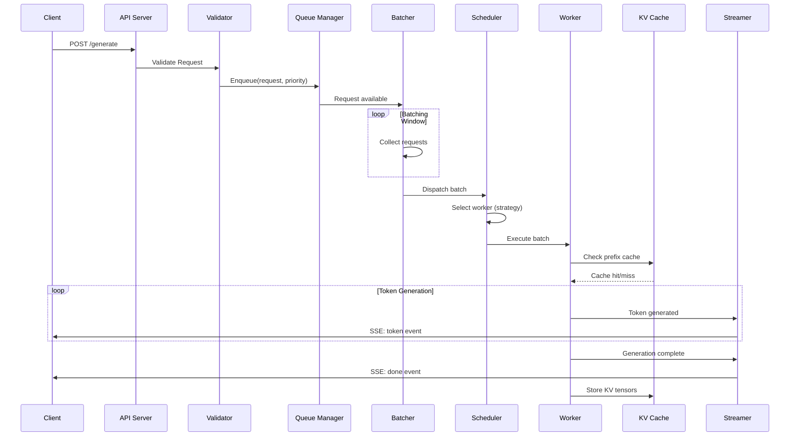

# Design Document: Distributed Inference Server

## Overview

This document describes the architecture and design of a production-grade Distributed Inference Server built in Rust. The system serves LLMs (Llama-3 8B or compatible) with advanced features including request batching, KV-cache management, real-time token streaming, adaptive scheduling, and multi-instance inference.

The server is designed around an async, event-driven architecture using Tokio as the runtime. It exposes HTTP endpoints via Axum, with optional gRPC support via Tonic. Model inference is handled through llama.cpp bindings (llama-cpp-rs) or optionally through remote inference providers.

### Key Design Principles

1. **Zero-Copy Where Possible**: Minimize memory allocations in hot paths
2. **Backpressure-First**: Never accept more work than can be processed
3. **Graceful Degradation**: Reduce quality before failing completely
4. **Observable by Default**: Every component emits metrics and traces

## Architecture



### Component Interaction Flow



## Components and Interfaces

### 1. API Server (`api/`)

Handles HTTP/gRPC request ingestion and response delivery.

```rust
/// API server configuration
pub struct ApiConfig {
    pub http_addr: SocketAddr,
    pub grpc_addr: Option<SocketAddr>,
    pub max_request_size: usize,
    pub request_timeout: Duration,
}

/// Main API server trait
#[async_trait]
pub trait ApiServer: Send + Sync {
    async fn start(&self) -> Result<(), ServerError>;
    async fn shutdown(&self) -> Result<(), ServerError>;
    fn health_check(&self) -> HealthStatus;
}

/// Request handler for inference endpoints
#[async_trait]
pub trait InferenceHandler: Send + Sync {
    async fn generate(&self, req: GenerateRequest) -> Result<GenerateResponse, ApiError>;
    async fn generate_stream(&self, req: GenerateRequest) -> Result<TokenStream, ApiError>;
    async fn chat(&self, req: ChatRequest) -> Result<ChatResponse, ApiError>;
    async fn chat_stream(&self, req: ChatRequest) -> Result<TokenStream, ApiError>;
    async fn embeddings(&self, req: EmbeddingsRequest) -> Result<EmbeddingsResponse, ApiError>;
}
```

### 2. Request Validator (`validator/`)

Validates incoming requests against schema and resource limits.

```rust
/// Validation result
pub type ValidationResult<T> = Result<ValidatedRequest<T>, ValidationError>;

/// Validator trait
pub trait RequestValidator: Send + Sync {
    fn validate_generate(&self, req: &GenerateRequest) -> ValidationResult<GenerateRequest>;
    fn validate_chat(&self, req: &ChatRequest) -> ValidationResult<ChatRequest>;
    fn validate_embeddings(&self, req: &EmbeddingsRequest) -> ValidationResult<EmbeddingsRequest>;
    fn token_count(&self, text: &str) -> usize;
}

/// Validation errors
#[derive(Debug, thiserror::Error)]
pub enum ValidationError {
    #[error("Invalid JSON: {0}")]
    InvalidJson(String),
    #[error("Missing required field: {0}")]
    MissingField(String),
    #[error("Token limit exceeded: {actual} > {limit}")]
    TokenLimitExceeded { actual: usize, limit: usize },
    #[error("Invalid parameter: {field} - {reason}")]
    InvalidParameter { field: String, reason: String },
}
```

### 3. Queue Manager (`queue/`)

Manages priority queues with backpressure control.

```rust
/// Queue configuration
pub struct QueueConfig {
    pub high_watermark: usize,
    pub low_watermark: usize,
    pub request_timeout: Duration,
    pub max_queue_size: usize,
}

/// Priority levels
#[derive(Debug, Clone, Copy, PartialEq, Eq, PartialOrd, Ord)]
pub enum Priority {
    Low = 0,
    Normal = 1,
    High = 2,
}

/// Queue manager trait
#[async_trait]
pub trait QueueManager: Send + Sync {
    async fn enqueue(&self, request: InferenceRequest, priority: Priority) -> Result<RequestId, QueueError>;
    async fn dequeue_batch(&self, max_size: usize) -> Vec<InferenceRequest>;
    fn queue_depth(&self) -> QueueDepth;
    fn is_accepting(&self) -> bool;
    async fn cancel(&self, request_id: RequestId) -> Result<(), QueueError>;
}

/// Queue depth by priority
pub struct QueueDepth {
    pub high: usize,
    pub normal: usize,
    pub low: usize,
    pub total: usize,
}
```

### 4. Request Batcher (`batcher/`)

Groups requests into efficient batches for inference.

```rust
/// Batcher configuration
pub struct BatcherConfig {
    pub max_batch_size: usize,
    pub batch_timeout: Duration,
    pub max_sequence_length: usize,
    pub padding_token_id: u32,
}

/// A batch of requests ready for inference
pub struct InferenceBatch {
    pub id: BatchId,
    pub requests: Vec<BatchedRequest>,
    pub input_ids: Vec<Vec<u32>>,
    pub attention_mask: Vec<Vec<u8>>,
    pub max_new_tokens: usize,
    pub created_at: Instant,
}

/// Batcher trait
#[async_trait]
pub trait RequestBatcher: Send + Sync {
    async fn add_request(&self, request: InferenceRequest) -> Result<(), BatcherError>;
    async fn get_batch(&self) -> Option<InferenceBatch>;
    fn pending_count(&self) -> usize;
    fn current_batch_size(&self) -> usize;
}

/// Batched request with metadata
pub struct BatchedRequest {
    pub id: RequestId,
    pub original_length: usize,
    pub padded_length: usize,
    pub response_tx: oneshot::Sender<InferenceResult>,
    pub stream_tx: Option<mpsc::Sender<TokenEvent>>,
}
```

### 5. Adaptive Scheduler (`scheduler/`)

Routes batches to workers based on configurable strategies.

```rust
/// Scheduling strategies
#[derive(Debug, Clone, Copy)]
pub enum SchedulingStrategy {
    RoundRobin,
    LeastLoaded,
    MemoryAware,
}

/// Scheduler configuration
pub struct SchedulerConfig {
    pub strategy: SchedulingStrategy,
    pub health_check_interval: Duration,
    pub worker_timeout: Duration,
}

/// Worker status
pub struct WorkerStatus {
    pub id: WorkerId,
    pub active_batches: usize,
    pub memory_used: usize,
    pub memory_available: usize,
    pub is_healthy: bool,
    pub last_health_check: Instant,
}

/// Scheduler trait
#[async_trait]
pub trait Scheduler: Send + Sync {
    async fn schedule(&self, batch: InferenceBatch) -> Result<WorkerId, SchedulerError>;
    async fn register_worker(&self, worker: WorkerHandle) -> Result<WorkerId, SchedulerError>;
    async fn unregister_worker(&self, worker_id: WorkerId) -> Result<(), SchedulerError>;
    fn worker_statuses(&self) -> Vec<WorkerStatus>;
    async fn set_strategy(&self, strategy: SchedulingStrategy);
}
```

### 6. Inference Worker (`worker/`)

Executes model inference on batches.

```rust
/// Worker configuration
pub struct WorkerConfig {
    pub model_path: PathBuf,
    pub context_size: usize,
    pub gpu_layers: usize,
    pub threads: usize,
    pub quantization: Quantization,
}

/// Quantization levels
#[derive(Debug, Clone, Copy)]
pub enum Quantization {
    F32,
    F16,
    Q8_0,
    Q4_0,
    Q4_K_M,
}

/// Inference worker trait
#[async_trait]
pub trait InferenceWorker: Send + Sync {
    async fn initialize(&mut self) -> Result<(), WorkerError>;
    async fn infer(&self, batch: InferenceBatch) -> Result<BatchResult, WorkerError>;
    async fn shutdown(&mut self) -> Result<(), WorkerError>;
    fn status(&self) -> WorkerStatus;
    fn model_info(&self) -> ModelInfo;
}

/// Batch inference result
pub struct BatchResult {
    pub batch_id: BatchId,
    pub results: Vec<RequestResult>,
    pub inference_time: Duration,
    pub tokens_generated: usize,
}

/// Individual request result
pub struct RequestResult {
    pub request_id: RequestId,
    pub tokens: Vec<u32>,
    pub text: String,
    pub finish_reason: FinishReason,
    pub prompt_tokens: usize,
    pub completion_tokens: usize,
}
```

### 7. KV Cache Manager (`cache/`)

Manages key-value cache for attention layers.

```rust
/// Cache configuration
pub struct CacheConfig {
    pub max_memory_bytes: usize,
    pub memory_threshold: f32,  // 0.8 = 80%
    pub ttl: Option<Duration>,
}

/// Cache entry
pub struct CacheEntry {
    pub key: CacheKey,
    pub kv_tensors: KVTensors,
    pub token_count: usize,
    pub created_at: Instant,
    pub last_accessed: Instant,
    pub access_count: u64,
}

/// KV tensors for a sequence
pub struct KVTensors {
    pub keys: Vec<Vec<f32>>,    // [layer][head * dim * seq_len]
    pub values: Vec<Vec<f32>>,  // [layer][head * dim * seq_len]
    pub sequence_length: usize,
}

/// Cache manager trait
#[async_trait]
pub trait KVCacheManager: Send + Sync {
    async fn get(&self, key: &CacheKey) -> Option<CacheEntry>;
    async fn get_prefix(&self, tokens: &[u32]) -> Option<(CacheEntry, usize)>;
    async fn put(&self, key: CacheKey, entry: CacheEntry) -> Result<(), CacheError>;
    async fn evict_lru(&self, bytes_needed: usize) -> usize;
    fn stats(&self) -> CacheStats;
    fn serialize(&self, entry: &CacheEntry) -> Result<Vec<u8>, CacheError>;
    fn deserialize(&self, bytes: &[u8]) -> Result<CacheEntry, CacheError>;
}

/// Cache statistics
pub struct CacheStats {
    pub entries: usize,
    pub memory_used: usize,
    pub memory_limit: usize,
    pub hit_count: u64,
    pub miss_count: u64,
    pub eviction_count: u64,
}
```

### 8. Token Streamer (`streamer/`)

Handles real-time token delivery to clients.

```rust
/// Stream event types
#[derive(Debug, Clone, Serialize)]
#[serde(tag = "type")]
pub enum TokenEvent {
    Token {
        token: String,
        index: usize,
        logprob: Option<f32>,
    },
    Done {
        finish_reason: FinishReason,
        usage: Usage,
    },
    Error {
        message: String,
        code: String,
    },
}

/// Finish reasons
#[derive(Debug, Clone, Copy, Serialize)]
#[serde(rename_all = "snake_case")]
pub enum FinishReason {
    Stop,
    Length,
    StopSequence,
}

/// Token stream type
pub type TokenStream = Pin<Box<dyn Stream<Item = TokenEvent> + Send>>;

/// Streamer trait
#[async_trait]
pub trait TokenStreamer: Send + Sync {
    fn create_stream(&self, request_id: RequestId) -> (mpsc::Sender<TokenEvent>, TokenStream);
    async fn send_token(&self, request_id: RequestId, event: TokenEvent) -> Result<(), StreamError>;
    async fn close_stream(&self, request_id: RequestId, reason: FinishReason);
    fn active_streams(&self) -> usize;
}
```

### 9. Metrics Collector (`metrics/`)

Collects and exposes system metrics.

```rust
/// Metrics collector trait
pub trait MetricsCollector: Send + Sync {
    fn record_request(&self, endpoint: &str, status: u16, duration: Duration);
    fn record_batch(&self, size: usize, padding_ratio: f32);
    fn record_inference(&self, tokens: usize, duration: Duration);
    fn record_ttft(&self, duration: Duration);
    fn record_cache_access(&self, hit: bool);
    fn record_queue_depth(&self, depth: &QueueDepth);
    fn record_worker_status(&self, status: &WorkerStatus);
    fn snapshot(&self) -> MetricsSnapshot;
}

/// Metrics snapshot for /server/stats
#[derive(Debug, Serialize)]
pub struct MetricsSnapshot {
    pub requests_total: u64,
    pub requests_active: u64,
    pub tokens_per_second: f64,
    pub avg_ttft_ms: f64,
    pub avg_latency_ms: f64,
    pub p99_latency_ms: f64,
    pub batch_size_avg: f64,
    pub cache_hit_rate: f64,
    pub queue_depth: QueueDepth,
    pub workers: Vec<WorkerStatus>,
}
```

## Data Models

### Request Models

```rust
/// Generate request
#[derive(Debug, Clone, Deserialize)]
pub struct GenerateRequest {
    pub prompt: String,
    #[serde(default = "default_max_tokens")]
    pub max_tokens: usize,
    #[serde(default = "default_temperature")]
    pub temperature: f32,
    #[serde(default = "default_top_p")]
    pub top_p: f32,
    #[serde(default)]
    pub stop_sequences: Vec<String>,
    #[serde(default)]
    pub stream: bool,
    #[serde(default)]
    pub priority: Option<Priority>,
}

/// Chat message
#[derive(Debug, Clone, Serialize, Deserialize)]
pub struct ChatMessage {
    pub role: Role,
    pub content: String,
}

/// Chat roles
#[derive(Debug, Clone, Copy, Serialize, Deserialize)]
#[serde(rename_all = "lowercase")]
pub enum Role {
    System,
    User,
    Assistant,
}

/// Chat request
#[derive(Debug, Clone, Deserialize)]
pub struct ChatRequest {
    pub messages: Vec<ChatMessage>,
    #[serde(default = "default_max_tokens")]
    pub max_tokens: usize,
    #[serde(default = "default_temperature")]
    pub temperature: f32,
    #[serde(default = "default_top_p")]
    pub top_p: f32,
    #[serde(default)]
    pub stop_sequences: Vec<String>,
    #[serde(default)]
    pub stream: bool,
}

/// Embeddings request
#[derive(Debug, Clone, Deserialize)]
pub struct EmbeddingsRequest {
    pub input: EmbeddingsInput,
    #[serde(default)]
    pub model: Option<String>,
}

#[derive(Debug, Clone, Deserialize)]
#[serde(untagged)]
pub enum EmbeddingsInput {
    Single(String),
    Multiple(Vec<String>),
}
```

### Response Models

```rust
/// Generate response
#[derive(Debug, Clone, Serialize)]
pub struct GenerateResponse {
    pub id: String,
    pub object: &'static str,
    pub created: u64,
    pub model: String,
    pub choices: Vec<GenerateChoice>,
    pub usage: Usage,
}

#[derive(Debug, Clone, Serialize)]
pub struct GenerateChoice {
    pub text: String,
    pub index: usize,
    pub finish_reason: FinishReason,
}

/// Chat response
#[derive(Debug, Clone, Serialize)]
pub struct ChatResponse {
    pub id: String,
    pub object: &'static str,
    pub created: u64,
    pub model: String,
    pub choices: Vec<ChatChoice>,
    pub usage: Usage,
}

#[derive(Debug, Clone, Serialize)]
pub struct ChatChoice {
    pub index: usize,
    pub message: ChatMessage,
    pub finish_reason: FinishReason,
}

/// Embeddings response
#[derive(Debug, Clone, Serialize)]
pub struct EmbeddingsResponse {
    pub object: &'static str,
    pub data: Vec<EmbeddingData>,
    pub model: String,
    pub usage: Usage,
}

#[derive(Debug, Clone, Serialize)]
pub struct EmbeddingData {
    pub object: &'static str,
    pub embedding: Vec<f32>,
    pub index: usize,
}

/// Token usage
#[derive(Debug, Clone, Default, Serialize)]
pub struct Usage {
    pub prompt_tokens: usize,
    pub completion_tokens: usize,
    pub total_tokens: usize,
}

/// Error response
#[derive(Debug, Clone, Serialize)]
pub struct ErrorResponse {
    pub error: ErrorDetail,
}

#[derive(Debug, Clone, Serialize)]
pub struct ErrorDetail {
    pub message: String,
    #[serde(rename = "type")]
    pub error_type: String,
    pub code: String,
}
```

### Internal Models

```rust
/// Internal inference request
pub struct InferenceRequest {
    pub id: RequestId,
    pub request_type: RequestType,
    pub tokens: Vec<u32>,
    pub params: InferenceParams,
    pub created_at: Instant,
    pub deadline: Instant,
    pub response_tx: oneshot::Sender<InferenceResult>,
    pub stream_tx: Option<mpsc::Sender<TokenEvent>>,
}

#[derive(Debug, Clone, Copy)]
pub enum RequestType {
    Generate,
    Chat,
    Embeddings,
}

#[derive(Debug, Clone)]
pub struct InferenceParams {
    pub max_tokens: usize,
    pub temperature: f32,
    pub top_p: f32,
    pub stop_sequences: Vec<Vec<u32>>,
}

/// Type aliases for IDs
pub type RequestId = uuid::Uuid;
pub type BatchId = uuid::Uuid;
pub type WorkerId = u32;
pub type CacheKey = Vec<u32>;  // Token sequence as cache key
```

## Correctness Properties

_A property is a characteristic or behavior that should hold true across all valid executions of a system—essentially, a formal statement about what the system should do. Properties serve as the bridge between human-readable specifications and machine-verifiable correctness guarantees._

Based on the acceptance criteria analysis, the following correctness properties must be validated through property-based testing:

### Property 1: Valid Request Acceptance

_For any_ valid `GenerateRequest` with non-empty prompt within token limits and valid parameter ranges, the Inference Server SHALL accept the request and return a valid UUID request ID.

**Validates: Requirements 1.1**

### Property 2: Invalid Request Rejection

_For any_ request payload that is malformed JSON, missing required fields, or contains out-of-range parameters, the Inference Server SHALL return HTTP 400 with an error response containing `message`, `type`, and `code` fields.

**Validates: Requirements 1.4**

### Property 3: Token Limit Enforcement

_For any_ prompt where `token_count(prompt) > context_window_limit`, the Inference Server SHALL reject the request with HTTP 400 and error message indicating token limit exceeded.

**Validates: Requirements 1.5**

### Property 4: Batch Formation Within Window

_For any_ set of N requests (where N ≤ max_batch_size) arriving within the batching window, the Request Batcher SHALL group them into a single batch containing exactly N requests.

**Validates: Requirements 2.1, 2.2**

### Property 5: Batch Padding Correctness

_For any_ batch containing requests with sequence lengths [L1, L2, ..., Ln], the Request Batcher SHALL pad all sequences to max(L1, L2, ..., Ln) and the `original_length` field for each request SHALL equal its pre-padding length.

**Validates: Requirements 2.3**

### Property 6: Priority Queue Ordering

_For any_ set of requests with mixed priorities, when dequeuing, all High priority requests SHALL be returned before Normal priority requests, and all Normal priority requests SHALL be returned before Low priority requests, while requests within the same priority level maintain FIFO order.

**Validates: Requirements 3.4, 3.5**

### Property 7: Backpressure Hysteresis

_For any_ queue state, if `queue_depth > high_watermark` then `is_accepting() == false`, and if `queue_depth < low_watermark` then `is_accepting() == true`. The state SHALL only change when crossing the respective watermark thresholds.

**Validates: Requirements 3.1, 3.2**

### Property 8: Request Timeout Enforcement

_For any_ request that remains in the queue for duration D where D > timeout_threshold, the Scheduler SHALL remove the request and the client SHALL receive HTTP 408.

**Validates: Requirements 3.3**

### Property 9: KV Cache Prefix Reuse

_For any_ two requests R1 and R2 where R2's token sequence starts with R1's token sequence (prefix match), if R1's KV tensors are cached, then processing R2 SHALL reuse the cached tensors for the shared prefix portion.

**Validates: Requirements 4.1**

### Property 10: LRU Cache Eviction

_For any_ cache state where memory_used > memory_limit, after eviction the least recently accessed entries SHALL be removed first, and memory_used SHALL be ≤ memory_limit.

**Validates: Requirements 4.2**

### Property 11: Cache Access Timestamp Update

_For any_ cache entry, after `get(key)` is called, the entry's `last_accessed` timestamp SHALL be greater than or equal to its previous value.

**Validates: Requirements 4.3**

### Property 12: Cache Serialization Round-Trip

_For any_ valid `CacheEntry`, `deserialize(serialize(entry))` SHALL produce a `CacheEntry` equivalent to the original entry (same key, kv_tensors, token_count).

**Validates: Requirements 4.6**

### Property 13: SSE Token Event Format

_For any_ generated token, the Token Streamer SHALL produce an SSE-formatted event where the JSON payload contains `token` (string), `index` (integer), and optionally `logprob` (float) fields.

**Validates: Requirements 5.2**

### Property 14: Stream Completion Event

_For any_ completed generation, the final SSE event SHALL contain `finish_reason` set to one of `stop`, `length`, or `stop_sequence`, and a `usage` object with `prompt_tokens`, `completion_tokens`, and `total_tokens` fields.

**Validates: Requirements 5.3**

### Property 15: Streaming Error Event Format

_For any_ error during generation, the Token Streamer SHALL send an error event with `message` (string) and `code` (string) fields before closing the connection.

**Validates: Requirements 5.5**

### Property 16: Least-Loaded Routing

_For any_ set of workers with active batch counts [B1, B2, ..., Bn], when using least-loaded strategy, the Scheduler SHALL route the next batch to a worker Wi where Bi = min(B1, B2, ..., Bn).

**Validates: Requirements 6.2**

### Property 17: Memory-Aware Routing

_For any_ batch with estimated memory requirement M and set of workers with available memory [A1, A2, ..., An], when using memory-aware strategy, the Scheduler SHALL route to a worker Wi where Ai ≥ M, or reject if no such worker exists.

**Validates: Requirements 6.3**

### Property 18: Unhealthy Worker Removal

_For any_ worker that fails health check, the Scheduler SHALL remove it from the routing pool within the health_check_interval, and no new batches SHALL be routed to that worker.

**Validates: Requirements 6.4**

### Property 19: Worker Recovery Reinstatement

_For any_ previously unhealthy worker that passes health check, the Scheduler SHALL add it back to the routing pool and it SHALL be eligible for batch routing.

**Validates: Requirements 6.5**

### Property 20: Worker Count Configuration

_For any_ configured worker count N, after server startup, exactly N Inference Workers SHALL be spawned and report ready status.

**Validates: Requirements 7.1, 7.2**

### Property 21: Batch Inference Completion

_For any_ valid `InferenceBatch` with N requests, the Inference Worker SHALL return a `BatchResult` containing exactly N `RequestResult` entries, one for each input request.

**Validates: Requirements 7.3**

### Property 22: Request Failure Isolation

_For any_ batch where one request fails during inference, the failure SHALL only affect that specific request, and all other requests in the batch SHALL complete successfully or fail independently.

**Validates: Requirements 9.2**

### Property 23: API Response Format Consistency

_For any_ successful inference request, the response SHALL contain: `id` (string), `object` (string), `created` (integer timestamp), `model` (string), `choices` (array), and `usage` object with token counts.

**Validates: Requirements 11.1, 11.2, 11.3**

### Property 24: Error Response Format

_For any_ failed request, the response SHALL contain an `error` object with `message` (string), `type` (string), and `code` (string) fields.

**Validates: Requirements 11.4**

### Property 25: Response Serialization Round-Trip

_For any_ valid `GenerateResponse`, `ChatResponse`, or `EmbeddingsResponse`, deserializing the JSON serialization SHALL produce an equivalent response object.

**Validates: Requirements 11.5**

### Property 26: Configuration Precedence

_For any_ configuration parameter set in multiple sources (CLI, env, file), the value from the highest precedence source (CLI > env > file) SHALL be used.

**Validates: Requirements 10.1**

### Property 27: Invalid Configuration Rejection

_For any_ configuration with invalid values (negative numbers where positive required, invalid enum variants, missing required fields), the server SHALL exit with non-zero status and log specific validation errors.

**Validates: Requirements 10.4**

### Property 28: Model Swap Continuity

_For any_ model swap operation, requests submitted before the swap completes SHALL be served by the original model, and requests submitted after SHALL be served by the new model.

**Validates: Requirements 13.2, 13.3**

### Property 29: Model Swap Failure Recovery

_For any_ failed model swap operation, the server SHALL continue serving requests with the original model without interruption.

**Validates: Requirements 13.4**

## Error Handling

### Error Categories

```rust
/// Top-level server errors
#[derive(Debug, thiserror::Error)]
pub enum ServerError {
    #[error("Configuration error: {0}")]
    Config(#[from] ConfigError),
    #[error("Model loading error: {0}")]
    ModelLoad(#[from] ModelError),
    #[error("Worker error: {0}")]
    Worker(#[from] WorkerError),
    #[error("IO error: {0}")]
    Io(#[from] std::io::Error),
}

/// API-level errors (returned to clients)
#[derive(Debug, thiserror::Error)]
pub enum ApiError {
    #[error("Validation error: {0}")]
    Validation(#[from] ValidationError),
    #[error("Queue full")]
    QueueFull,
    #[error("Request timeout")]
    Timeout,
    #[error("Internal error: {0}")]
    Internal(String),
}

impl ApiError {
    pub fn status_code(&self) -> StatusCode {
        match self {
            ApiError::Validation(_) => StatusCode::BAD_REQUEST,
            ApiError::QueueFull => StatusCode::SERVICE_UNAVAILABLE,
            ApiError::Timeout => StatusCode::REQUEST_TIMEOUT,
            ApiError::Internal(_) => StatusCode::INTERNAL_SERVER_ERROR,
        }
    }

    pub fn error_type(&self) -> &'static str {
        match self {
            ApiError::Validation(_) => "invalid_request_error",
            ApiError::QueueFull => "rate_limit_error",
            ApiError::Timeout => "timeout_error",
            ApiError::Internal(_) => "server_error",
        }
    }
}
```

### Error Handling Strategy

1. **Validation Errors**: Return immediately with HTTP 400, detailed message
2. **Queue Full**: Return HTTP 503 with retry-after header
3. **Timeout**: Return HTTP 408, clean up resources
4. **Inference Errors**: Isolate to single request, return error in response
5. **Worker Crashes**: Detect, reassign work, restart worker
6. **Memory Pressure**: Evict cache, reduce batch size, reject if necessary

### Graceful Degradation

```rust
/// Degradation levels
pub enum DegradationLevel {
    Normal,
    ReducedBatchSize,    // Reduce max batch size by 50%
    AggressiveCacheEviction,  // Evict cache entries proactively
    RejectLowPriority,   // Only accept high-priority requests
    Emergency,           // Reject all new requests
}

impl DegradationLevel {
    pub fn from_memory_pressure(pressure: f32) -> Self {
        match pressure {
            p if p < 0.7 => DegradationLevel::Normal,
            p if p < 0.8 => DegradationLevel::ReducedBatchSize,
            p if p < 0.9 => DegradationLevel::AggressiveCacheEviction,
            p if p < 0.95 => DegradationLevel::RejectLowPriority,
            _ => DegradationLevel::Emergency,
        }
    }
}
```

## Testing Strategy

### Property-Based Testing Framework

The project will use **proptest** as the property-based testing library for Rust. Each correctness property will be implemented as a proptest test with a minimum of 100 iterations.

### Test Organization

```
tests/
├── properties/
│   ├── mod.rs
│   ├── request_validation.rs    # Properties 1-3
│   ├── batching.rs              # Properties 4-5
│   ├── queue.rs                 # Properties 6-8
│   ├── cache.rs                 # Properties 9-12
│   ├── streaming.rs             # Properties 13-15
│   ├── scheduling.rs            # Properties 16-19
│   ├── worker.rs                # Properties 20-22
│   ├── api_response.rs          # Properties 23-25
│   ├── config.rs                # Properties 26-27
│   └── model_swap.rs            # Properties 28-29
├── unit/
│   ├── validator_test.rs
│   ├── batcher_test.rs
│   ├── queue_test.rs
│   ├── cache_test.rs
│   └── scheduler_test.rs
└── integration/
    ├── api_test.rs
    ├── streaming_test.rs
    └── e2e_test.rs
```

### Property Test Annotation Format

Each property-based test MUST be annotated with:

```rust
/// **Feature: distributed-inference-server, Property 1: Valid Request Acceptance**
/// **Validates: Requirements 1.1**
#[test]
fn prop_valid_request_acceptance() {
    // ...
}
```

### Generator Strategies

```rust
// Request generators
fn arb_generate_request() -> impl Strategy<Value = GenerateRequest> {
    (
        "[a-zA-Z0-9 ]{1,1000}",  // prompt
        1usize..=2048,           // max_tokens
        0.0f32..=2.0,            // temperature
        0.0f32..=1.0,            // top_p
    ).prop_map(|(prompt, max_tokens, temperature, top_p)| {
        GenerateRequest {
            prompt,
            max_tokens,
            temperature,
            top_p,
            ..Default::default()
        }
    })
}

// Batch generators
fn arb_inference_batch(max_size: usize) -> impl Strategy<Value = Vec<InferenceRequest>> {
    prop::collection::vec(arb_inference_request(), 1..=max_size)
}

// Cache entry generators
fn arb_cache_entry() -> impl Strategy<Value = CacheEntry> {
    (
        prop::collection::vec(any::<u32>(), 1..100),  // key (tokens)
        arb_kv_tensors(),
    ).prop_map(|(key, kv_tensors)| {
        CacheEntry {
            key,
            kv_tensors,
            token_count: key.len(),
            created_at: Instant::now(),
            last_accessed: Instant::now(),
            access_count: 0,
        }
    })
}
```

### Unit Testing Focus

Unit tests will cover:

- Edge cases not easily captured by properties (empty inputs, boundary values)
- Error path verification
- Component integration points
- Mocked external dependencies (model inference)

### Integration Testing

Integration tests will verify:

- End-to-end request flow
- Streaming behavior with real HTTP connections
- Multi-worker coordination
- Graceful shutdown behavior

### Test Configuration

```toml
# Cargo.toml
[dev-dependencies]
proptest = "1.4"
tokio-test = "0.4"
wiremock = "0.5"
criterion = "0.5"

[profile.test]
opt-level = 1  # Faster property tests
```

### Minimum Test Iterations

All property-based tests MUST run a minimum of 100 iterations:

```rust
proptest! {
    #![proptest_config(ProptestConfig::with_cases(100))]

    #[test]
    fn prop_example(input in arb_input()) {
        // ...
    }
}
```
